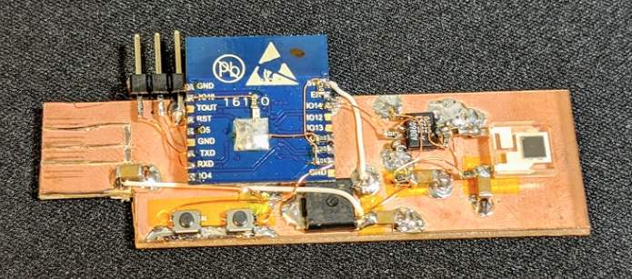
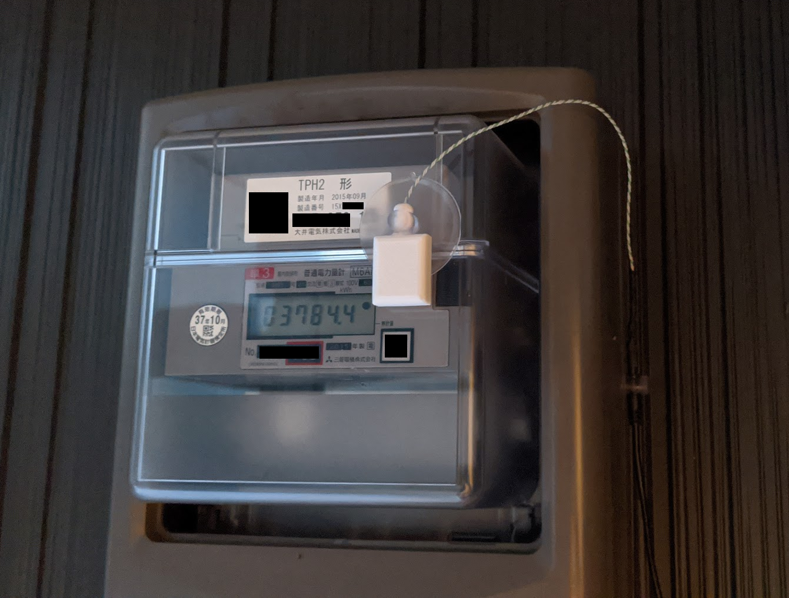
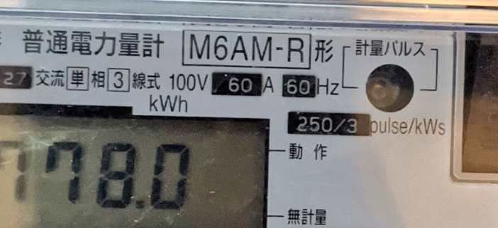
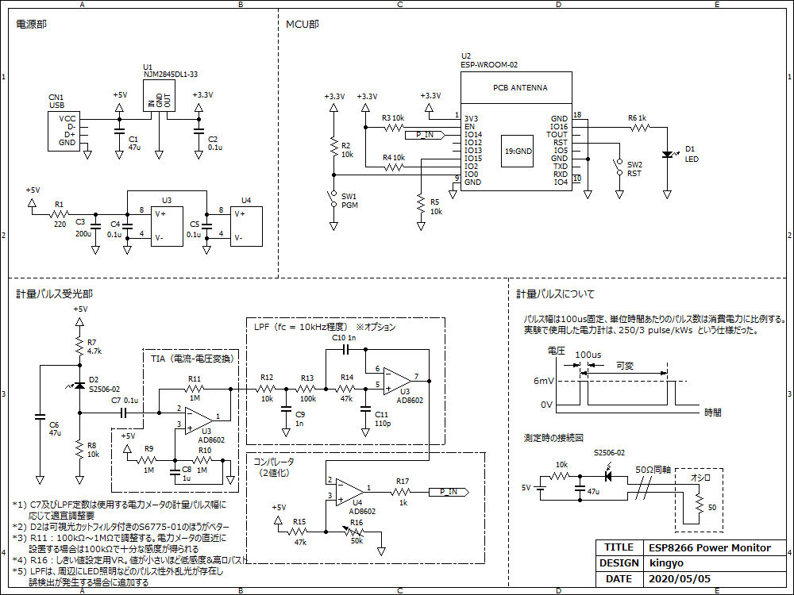

# ESP8266_PowerMonitor
 
ESP8266を用いた電力計のモニタ装置です。計量パルス出力に対応した電力計に装着して使用します。  
電力計から出力される計量パルスを受信し、ESP8266で計数して消費電力に換算します。換算結果はUDPで任意の端末、サーバなどに転送します。また、Ambientに投稿することも出来ます。 
UDP Terminalなどを使用するとスマホから現在の消費電力を監視できます。  

■制作例  
  
  
  
■計量パルス出力に対応した電力計の例  
「計量パルス」と書かれた穴から赤外光で計量パルスが出力されている。  
  
  
■動作の様子(YouTube)  
  
  
# 回路図
  
  
# 参考
- Ambient_ESP8266_lib https://github.com/AmbientDataInc/Ambient_ESP8266_lib  
- 2016-05-21 ESP8266 > udpLogger (with AccessPoint) > UDP受信文字列をSDに書込む https://qiita.com/7of9/items/6dc086b17fc43715b48b  
- ESP8266 > UDPで送信できた / esp8266_151219_udpSender https://qiita.com/7of9/items/a61999a914ae02673b8d
